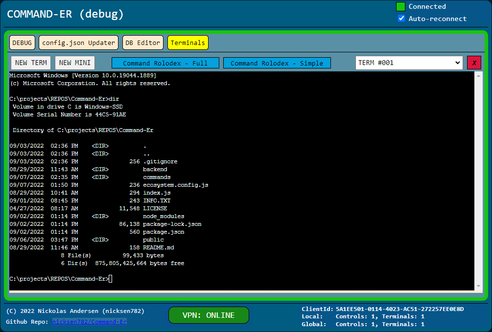

# Command-Er
* This is a web-based tool that allows you to run terminal commands from a web-browser.
* Works with Windows/Linux. (Mac is untested.)
* 

## Features:
* Use your web-browser to create and use terminals hosted by the server.
* Command Rolodex: Commands can be added/updated/removed in the database and easily ran when needed.
  * Keep all your commonly used commands in one central place!
* Multiple clients can connect to the same Command-Er instance and have separate terminals.
  - Command Rolodex is shared between connected clients. 
* NOTE: Not intended for multiple users with separate configurations.  

## Security:
* WARNING: Any connected client can run any command under the username of the spawned command terminal on the server.
* Thus it is a good idea to edit the public/shared/config.json file to only listen on 127.0.0.1.
  * This way nobody else on the network can connect to your terminals.
  * (EXAMPLE: Local only): `public/shared/config.json->node->http->host` : "127.0.0.1"
  * (EXAMPLE: Any interface): `public/shared/config.json->node->http->host` : "0.0.0.0"
  * (EXAMPLE: Specific interface): `public/shared/config.json->node->http->host` : "192.168.1.2"
* TODO: In the future a login system can be added to mitigate the threat of a user on your network connecting to your Command-Er instance.

## Command-Er MINI:
* In case you want a very simple way of running a command (especially repeatedly) you can use Command-Er MINI.
  * A very simple hand-held interface for selecting a command and sending it to Command-Er to run.
  * Further details at [Command-Er MINI](https://github.com/nicksen782/Command-Er_mini) on Github.

## Configuration
- Server configuation file is at `public/shared/config.json`.
  - If the file does not exist then the server will create config.json from config.json.example.
- Most of the config.json options can be left as they are. However there are a few sections that you should look at:
  - `config.json->node->http->host`: You can change the host to "127.0.0.1" or your local IP address.
  - `config.json->node->http->port`: You can change the port to a value of your choosing.
  - `config.json->db`: You can change the sqlite database file here. Look to the -> examples key for how to configure db->type, and db->file. 
    - For debug reasons you can also use a `memory` database. The server will initialize the db structure and you can use it normally but the database will disappear if the server is restarted.
      - Intended for debug purposes.
  - `config.json->terms`: You can change the terminal rows and cols here and especially the `shellType`.
    - The `shellType` needs to match a key within `shells`.
    - If you use Linux then set `shellType` to `linux` which will use `/bin/bash`. 
    - If you use Windows then set `shellType` to `win32a` or `win32b` which will use either `cmd` or `powershell`.
  - `config.json->connectionCheck`: This is intended to easily see if a VPN connection is active.
    - It uses a ping to the `url` value which should only be accessible via VPN.
      - If you are not using the VPN then set `active` to false.

# INSTALL
TODO
# Hosting via Apache (Ubuntu)
* Install these Apache modules.
    ````sh
    sudo a2enmod proxy
    sudo a2enmod proxy_http
    sudo a2enmod proxy_wstunnel
    ````
* You will need to add to your virtualHost config file.
  * (Ubuntu) Common location of the conf file: `/etc/apache2/sites-enabled/000-default.conf`
* Add this to the end of the file before the `</VirtualHost>` tag:
````sh
<Proxy *>
        Require all granted
</Proxy>

Redirect 301 /Command-Er /Command-Er/
<location /Command-Er/>
        ProxyPass        http://127.0.0.1:12345/
        ProxyPassReverse http://127.0.0.1:12345/
</location>
<location /Command-Er/CONTROL>
        ProxyPass        ws://127.0.0.1:12345/CONTROL
        ProxyPassReverse ws://127.0.0.1:12345/CONTROL
</location>
<location /Command-Er/TERM>
        ProxyPass        ws://127.0.0.1:12345/TERM
        ProxyPassReverse ws://127.0.0.1:12345/TERM
</location>
````